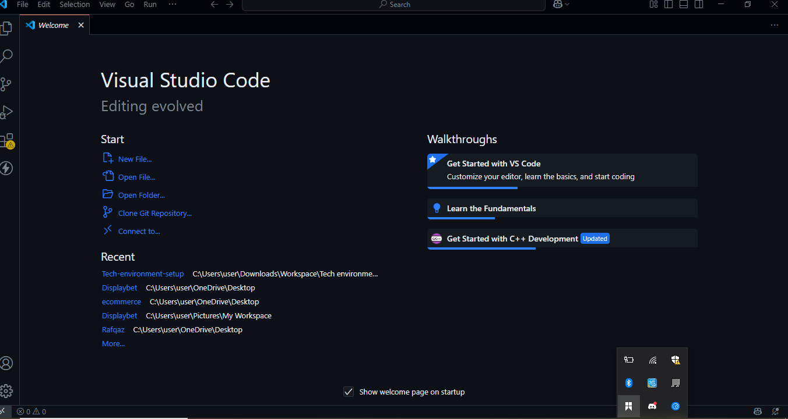
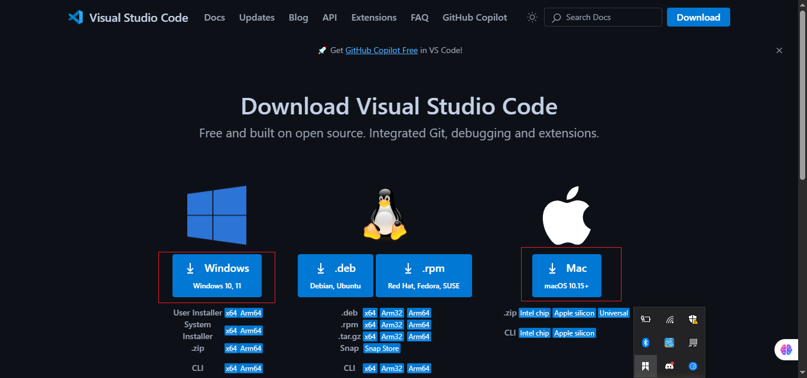
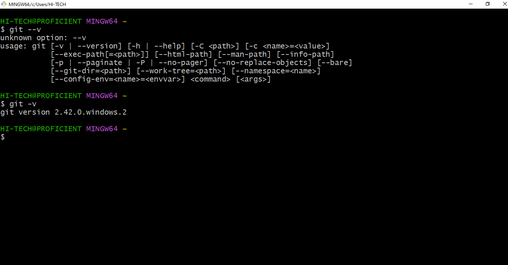
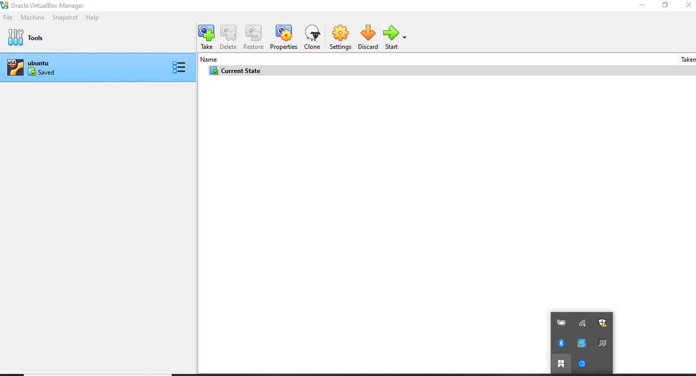
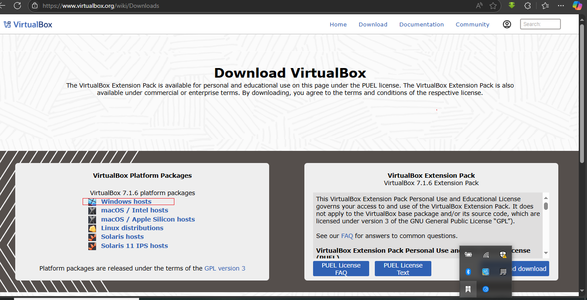
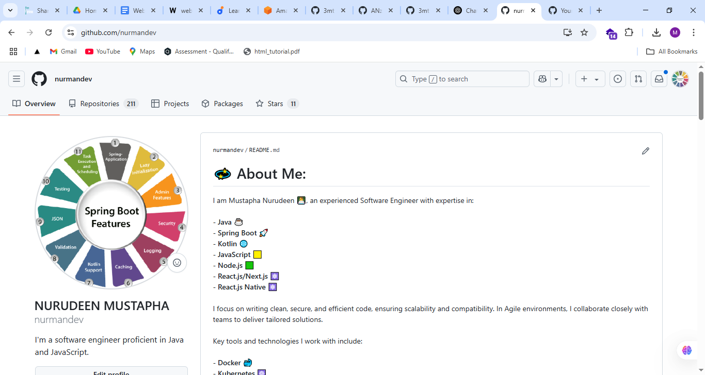
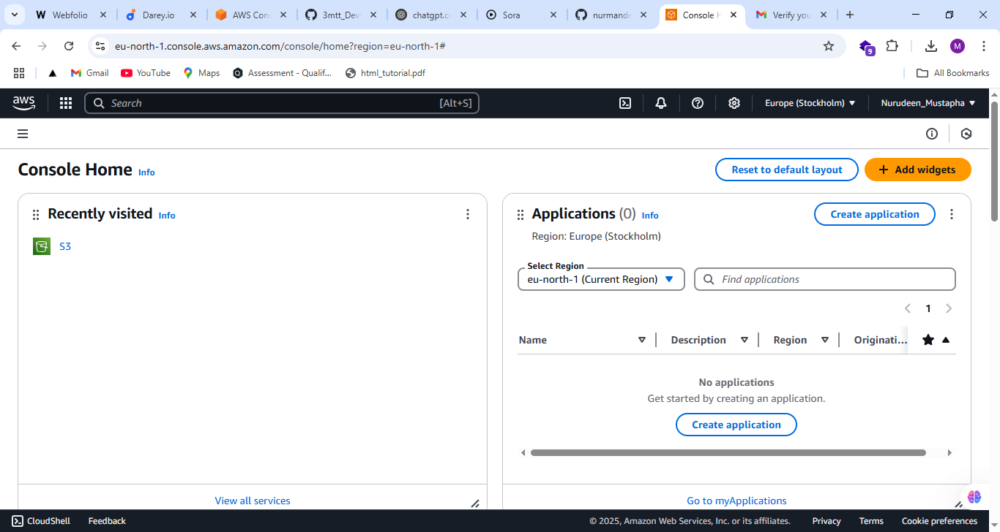

# 🚀 DevOps Mini Project – 3MTT Fellows Edition

This project involves setting up a **basic DevOps environment** as part of the **3MTT DevOps Track**. It covers:

- ✅ Git Version Control
- ✅ AWS Cloud Setup
- ✅ MobaXterm for SSH
- ✅ AWS Console Operations
- ✅ VirtualBox for VM Simulation
- ✅ GitHub Account Creation
- ✅ Ubuntu OS Installation in VirtualBox
- ✅ VS Code Setup

---

## 🧩 Table of Contents

1. [Project Overview](#project-overview)
2. [Tools Covered](#tools-covered)
3. [Setup Steps](#setup-steps)
4. [Screenshots](#screenshots)
5. [Folder Structure](#folder-structure)
6. [Author](#author)
7. [License](#license)

---

## 📌 Project Overview

This project builds the foundation for future DevOps pipelines, server setups, cloud operations, and automation. It includes complete setup instructions and validation screenshots as per the instructor's rubric.

---

## 🧰 Tools Covered

| Tool        | Purpose                               |
| ----------- | ------------------------------------- |
| Git         | Version control for source code       |
| AWS Console | Cloud infrastructure management       |
| MobaXterm   | SSH client for remote access          |
| VirtualBox  | Local VM testing environment          |
| Ubuntu OS   | Linux environment setup               |
| GitHub      | Source code repository hosting        |
| VS Code     | Code editor and developer environment |

---

## ⚙️ Setup Steps

### 🔹 1. VS Code Setup

- Download and install VS Code from [https://code.visualstudio.com/](https://code.visualstudio.com/)
- Launch and take a screenshot of the Welcome screen

📸 **VS Code Welcome Screen**  



---

### 🔹 2. Git Installation Confirmation

- Install Git: [https://git-scm.com/downloads](https://git-scm.com/downloads)
- Run in terminal:

```bash
git --version
```

📸 **Git Version Confirmation**  


---

### 🔹 3. VirtualBox Installation Confirmation

- Install from [https://www.virtualbox.org/](https://www.virtualbox.org/)
- Open VirtualBox Manager and screenshot the welcome screen

📸 **VirtualBox Welcome Screen**  



---

### 🔹 4. Ubuntu Installation inside VirtualBox

- Download Ubuntu ISO: [https://ubuntu.com/download](https://ubuntu.com/download)
- Install it on VirtualBox
- Screenshot the login screen after installation

📸 **Ubuntu Login Screen**  


---

### 🔹 5. GitHub Account Setup

- Create a GitHub account: [https://github.com/](https://github.com/)
- Login and screenshot your dashboard

📸 **GitHub Dashboard**  


---

### 🔹 6. AWS Account Setup

- Sign up at [https://aws.amazon.com/free](https://aws.amazon.com/free)
- Login to the AWS Management Console

📸 **AWS Console Dashboard**  


---

## 🖼️ Screenshots

Stored under `/screenshots`:

```bash
screenshots/
├── vscode-welcome.png
├── git.png
├── virtual-box.png
├── ubuntu-login.png
├── mobaxterm.png
├── github-dashboard.png
└── aws.png
```

---

## 🗂️ Folder Structure

```bash
devops-mini-project/
├── README.md
├── screenshots/
│   ├── vscode.png
│   ├── git-terminal.png
│   ├── virtualbox-welcome.png
│   ├── ubuntu-login.png
│   ├── github-dashboard.png
│   └── aws-console-dashboard.png
```

---

## 👤 Author

**NURUDEEN MUSTAPHA**  
GitHub: [nurmandev](https://github.com/nurmandev)  
Email: adebayour66265@gmail.com

---

## 📄 License

This project is licensed under the MIT License. See [LICENSE](./LICENSE) for details.
