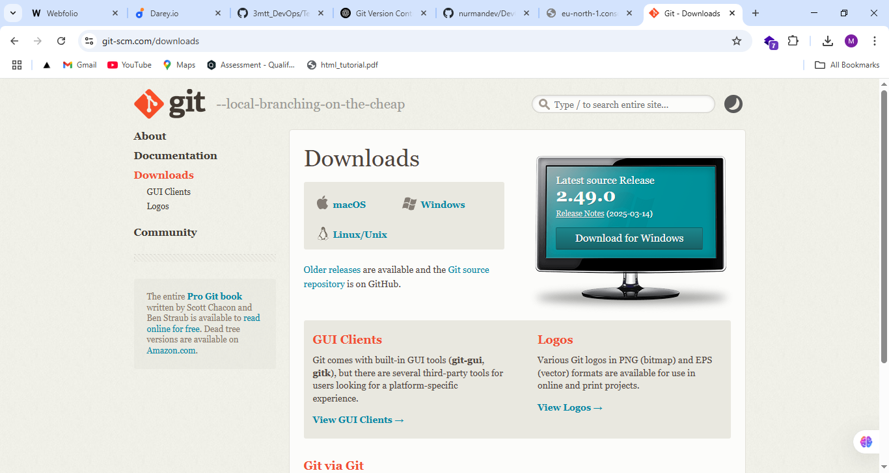

# 🚀 DevOps Mini Project – 3MTT Fellows Edition

This project involves setting up a **basic DevOps environment** consisting of:

- ✅ Git Version Control
- ✅ AWS Cloud Setup
- ✅ MobaXterm for SSH
- ✅ AWS Console Operations
- ✅ VirtualBox for Virtual Machine Simulation

It is part of the **3MTT DevOps Track** and aims to provide hands-on experience with industry-standard tools and workflows.

---

## 🧩 Table of Contents

1. [Project Overview](#project-overview)
2. [Tools Covered](#tools-covered)
3. [Setup Steps](#setup-steps)
   - Git
   - AWS Account
   - MobaXterm
   - AWS Console
   - VirtualBox
4. [Screenshots](#screenshots)
5. [Author](#author)
6. [License](#license)

---

## 📌 Project Overview

This project serves as a foundational environment for future DevOps pipelines, CI/CD automation, server configuration, and infrastructure-as-code.

You’ll walk through real-world tasks:

- Initializing Git repos
- SSH into EC2 with MobaXterm
- Creating EC2 instances via AWS Console
- Using VirtualBox to simulate Linux environments
- Preparing a full DevOps-ready workspace

---

## 🧰 Tools Covered

| Tool        | Purpose                                       |
| ----------- | --------------------------------------------- |
| Git         | Version control for source code               |
| AWS Console | Cloud infrastructure management               |
| MobaXterm   | SSH client and terminal for accessing servers |
| VirtualBox  | Local VM testing environment                  |

---

## ⚙️ Setup Steps

### 🔹 1. Git Setup

- Install Git: [https://git-scm.com/downloads](https://git-scm.com/downloads)
- Configure Git:

```bash
git config --global user.name "Your Name"
git config --global user.email "your@email.com"
```

- Initialize a repo:

```bash
git init
```

📸 **Git Setup Screenshot**  


---

### 🔹 2. AWS Account Setup

- Sign up at [https://aws.amazon.com/free](https://aws.amazon.com/free)
- Verify your account
- Set up billing alerts (optional)
- Create IAM user with programmatic access
- Download access key and secret

📸 **AWS Account Screenshot**  


---

### 🔹 3. MobaXterm for SSH

- Download from [https://mobaxterm.mobatek.net/](https://mobaxterm.mobatek.net/)
- Open SSH session with your EC2 instance:

```bash
ssh -i "your-key.pem" ec2-user@your-ec2-ip
```

📸 **MobaXterm SSH Screenshot**  


---

### 🔹 4. AWS Console (EC2)

- Navigate to EC2 Dashboard
- Launch a new instance (e.g., Ubuntu)
- Configure storage and security group (allow port 22 for SSH)
- Launch and connect via public IP using MobaXterm

📸 **EC2 Instance Launch Screenshot**  


---

### 🔹 5. VirtualBox Setup

- Download from [https://www.virtualbox.org/](https://www.virtualbox.org/)
- Install Linux ISO (e.g., Ubuntu or CentOS)
- Create and run virtual machines locally

📸 **VirtualBox Screenshot**  


---

## 🖼️ Screenshots

All referenced images are stored in the `/screenshots` directory:

```bash
screenshots/
├── git-setup.png
├── aws-account.png
├── mobaxterm-ssh.png
├── ec2-instance.png
└── virtualbox.png
```

Feel free to replace these with your own actual screenshots during the setup.

---

## 👤 Author

**NURUDEEN MUSTAPHA**  
GitHub: [nurmandev](https://github.com/nurmandev)  
Email: adebayour66265@gmail.com

---

## 📄 License

This project is licensed under the MIT License. See [LICENSE](./LICENSE) for details.
